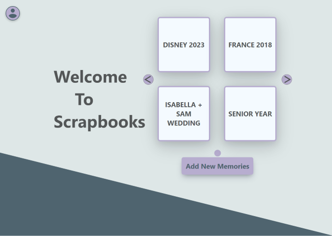
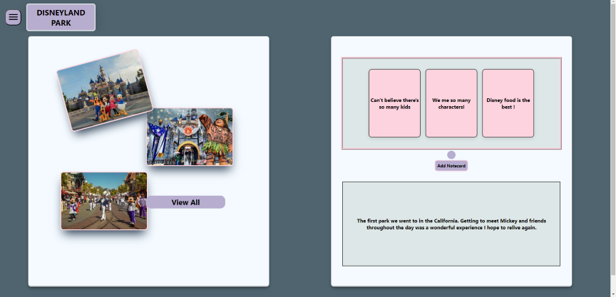
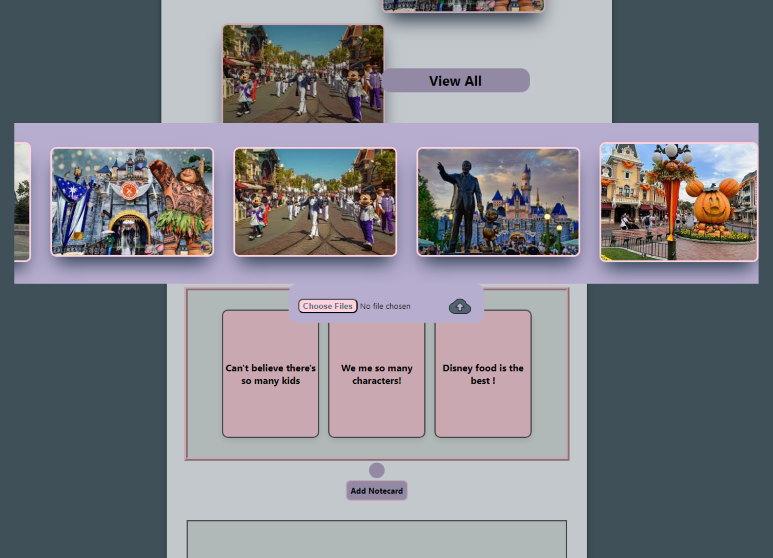

# Scrapbook App

*by Braulee*

## What is this?
Scrapbook attempts to help hold on to memories! In the digital era of things, it's not convenient to constantly 
print out photos to put into a physical scrapbook any more. While phone manafacturers attempt have albums to 
hold on to specific events and memories, they don't have the same feeling that scrapbooks had. **income Scrapbook**.
Scrapbook gives a unique UI to users to give a more unique feeling to collections of photos. Letting users comment on
events and add endless amounts of "books" with photos. Making it more enjoyable to store precious memories in a 
digital album.

## Gallery

## Framework
This app was build on Firebase with React Native

